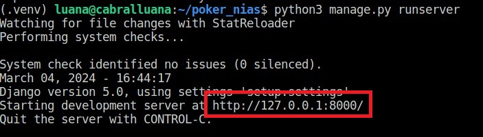

# Instruções de Configuração e Execução do Projeto

Este é um guia para configurar e executar o projeto em sua máquina local. Certifique-se de seguir cada passo cuidadosamente para garantir uma configuração adequada.

## Pré-requisitos

- Python instalado em sua máquina. Você pode baixar e instalar o Python a partir do [site oficial](https://www.python.org/downloads/).

## Instalação

1. Instale o `virtualenv` via pip. Se você não tem o pip instalado, siga as instruções [aqui](https://pip.pypa.io/en/stable/installation/):
   ```bash
   pip install virtualenv
   ```

2. Clone o repositório. Selecione o botão verde "Code" no canto superior direito do repositório no GitHub e copie a URL HTTPS.
   Abra o terminal na pasta desejada e execute o seguinte comando, substituindo `<link_do_repositório>` pela URL copiada:
   ```bash
   git clone <link_do_repositório>
   ```

## Configuração do Ambiente Virtual

1. Abra um novo terminal na IDE do Visual Studio Code (Ctrl+J).

2. Crie um ambiente virtual na pasta do projeto executando o seguinte comando, dependendo do seu sistema operacional:
   - **Windows**:
     ```bash
     python -m virtualenv .venv
     ```
   ou
     ```bash
     python -m venv .venv
     ```
   - **Linux/macOS**:
     ```bash
     python3 -m venv .venv
     ```

3. Ative o ambiente virtual. Dependendo do seu sistema operacional, execute o seguinte comando:
   - **Windows**:
     ```bash
     .venv\Scripts\activate
     ```
     Se o comando acima não funcionar devido à execução de scripts estar desabilitada, execute o seguinte comando antes e tente novamente:
     ```bash
     Set-ExecutionPolicy RemoteSigned -Scope Process
     ```
   - **Linux/macOS**:
     ```bash
     source .venv/bin/activate
     ```

   Após ativar o ambiente virtual, você verá "(.venv)" antes do prompt de comando, indicando que está ativado.

## Instalação de Dependências

Instale todas as dependências listadas no arquivo "requirements.txt" executando o seguinte comando:
```bash
pip install -r requirements.txt
```

## Configuração do Banco de Dados

1. Execute o seguinte comando para criar migrações:
   - **Windows**:
     ```bash
     python manage.py makemigrations
     ```
   - **Linux/macOS**:
     ```bash
     python3 manage.py makemigrations
     ```

2. Execute o seguinte comando para aplicar as migrações e configurar o banco de dados:
   - **Windows**:
     ```bash
     python manage.py migrate
     ```
   - **Linux/macOS**:
     ```bash
     python3 manage.py migrate
     ```

## Criação de Superusuário

Como o projeto foi clonado, não há dados de usuário disponíveis. Você precisará criar um novo superusuário para acessar o sistema. No terminal do VS Code, digite:
   - **Windows**:
     ```bash
     python manage.py createsuperuser
     ```
   - **Linux/macOS**:
     ```bash
     python3 manage.py createsuperuser
     ```

Siga as instruções para configurar o nome de usuário, email e senha do superusuário.

## Execução do Servidor

Para executar o projeto localmente, utilize o comando:
   - **Windows**:
     ```bash
     python manage.py runserver
     ```
   - **Linux/macOS**:
     ```bash
     python3 manage.py runserver
     ```

Agora o projeto estará rodando no localhost. Para acessá-lo, clique no link gerado (circulado em vermelho) ou digite-o em seu navegador.


